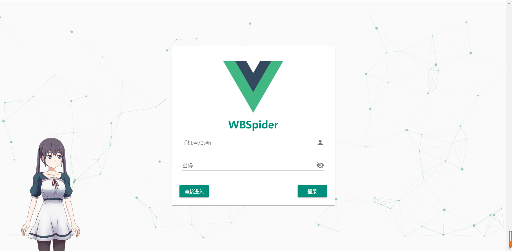
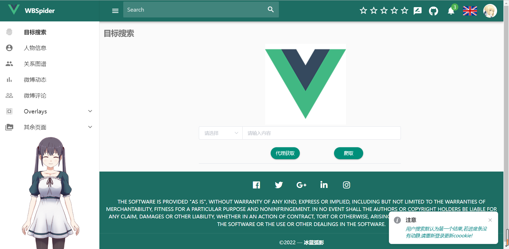

## Feature

1. 通过帐户密码登录，**需要手机端手动验证**
2. 支持cookie文件读取
3. 支持关键词搜索用户
5. 支持随机agent替换，防反爬
4. 爬取用户详细信息
5. 爬取用户关注和粉丝信息
6. 异步爬取用户热点微博及相关评论
7. 人际关系图谱
8. vue + flask 可视化

### 运行 

- 方法一：使用Git:  

```shell
git clone https://github.com/Blue-Arc/WBSpider.git/
```

> 墙国加速
>  
> ```shell
> git clone https://github.do/https://github.com/Blue-Arc/WBSpider.git
> ```

### 配置环境  

#### 直接使用

```bash
pip install --upgrade pip # 更新pip
pip install -r requirements.txt # 安装依赖库
python app.py
```

------

#### Pipenv虚拟环境(推荐)

> **请确保自己的电脑有 `python3.x` 的环境,推荐使用 `3.8` 及以上！**  

- 安装 pipenv 包管理工具.  

```shell
pip install pipenv
```

- 为项目构建虚拟环境.  

```shell
pipenv --python three #创建python3环境
pipenv install # 安装依赖包
```

- 尝试运行   

```shell
python app.py 
```

若无报错，输出帮助信息，则说明环境已经正确安装。

### 运行  

```shell
# python .\app.py
 * Serving Flask app 'app' (lazy loading)
 * Environment: production
   WARNING: This is a development server. Do not use it in a production deployment.
   Use a production WSGI server instead.
 * Debug mode: on
 * Running on http://127.0.0.1:5000 (Press CTRL+C to quit)
 * Restarting with stat
 * Debugger is active!
 * Debugger PIN: 330-024-692
```

- 启动爬虫  

#### 登录页面



------

#### 主页面




Todo List:
- [ ] id搜索

